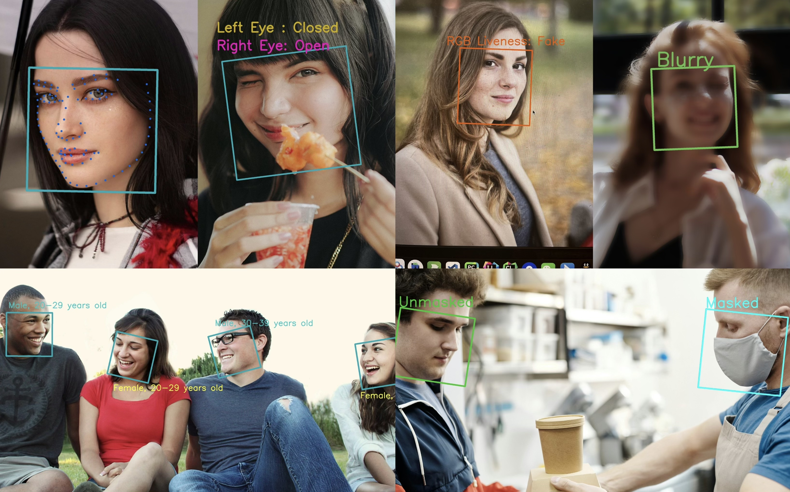

# react-native-nitro-inspire-face

A React Native library for face detection, recognition, and analysis, built on top of the [InspireFace](https://github.com/HyperInspire/InspireFace) SDK with [Nitro Modules](https://github.com/mrousavy/nitro) to bring native performance to your React Native face recognition features.



## Features

All features are powered by the underlying [InspireFace C++ SDK](https://github.com/HyperInspire/InspireFace):

- Face detection and tracking
- Face recognition and comparison
- Facial landmarks detection (106-point dense + 5-point key)
- Face quality assessment
- Mask detection
- Liveness detection (both silent and cooperative)
- Face attribute analysis (age, gender, race)
- Face emotion recognition
- Face pose estimation
- Face embedding management (FeatureHub with search, insert, update, remove)
- Zero-copy camera frame processing via `createEmptyImageStream()` + `setBuffer()`
- Configurable landmark engines (HypLMv2, InsightFace)
- Apple CoreML / CUDA hardware acceleration
- SDK log level control

## Zero-Copy Video Processing

For real-time camera feeds, avoid per-frame allocations by reusing a single stream:

```typescript
// Create once
const stream = InspireFace.createEmptyImageStream();
stream.setFormat(ImageFormat.YUV_NV21);
stream.setRotation(CameraRotation.ROTATION_90);

// Each frame — just swaps the pointer, zero allocations
stream.setBuffer(frameBuffer, width, height);
const faces = session.executeFaceTrack(stream);

// Clean up when done
stream.dispose();
```

## Documentation

- [Nitro Inspire Face Docs](https://ronickg.github.io/react-native-nitro-inspire-face/)

- For more technical details, visit the [InspireFace repository](https://github.com/HyperInspire/InspireFace).

## Contributing

See the [contributing guide](CONTRIBUTING.md) to learn how to contribute to the repository and the development workflow.

## Acknowledgement

- [InspireFace](https://github.com/HyperInspire/InspireFace) - The underlying C++ SDK
- [Marc Rousavy](https://github.com/mrousavy) - Nitro modules

## License

MIT
