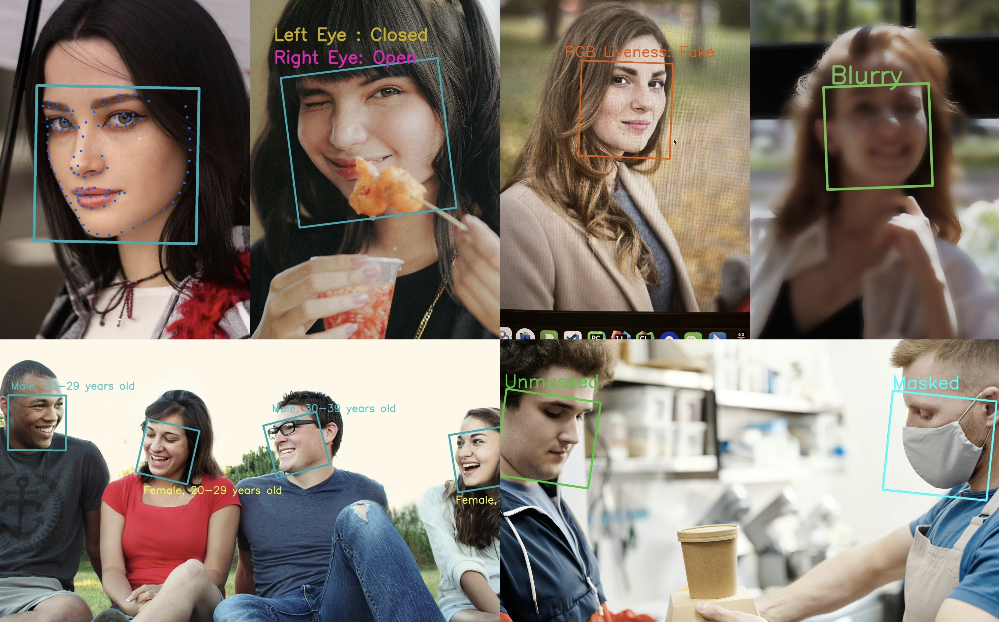

# Intro

A React Native library that provides face detection, recognition, and analysis capabilities using the InspireFace SDK. This library is built on top of [InspireFace](https://github.com/HyperInspire/InspireFace), a powerful cross-platform face recognition SDK developed in C/C++. Powered by [NitroModules](https://github.com/mrousavy/nitro).

## Features

All features are powered by the underlying [InspireFace C++ SDK](https://github.com/HyperInspire/InspireFace):

- Face detection and tracking
- Face recognition and comparison
- Facial landmarks detection
- Face quality assessment
- Mask detection
- Liveness detection (both silent and cooperative)
- Face attribute analysis
- Face pose estimation
- Face embedding management

## Acknowledgement

- [InspireFace](https://github.com/HyperInspire/InspireFace) - The underlying C++ SDK
- [Marc Rousavy](https://github.com/mrousavy) - Nitro modules
